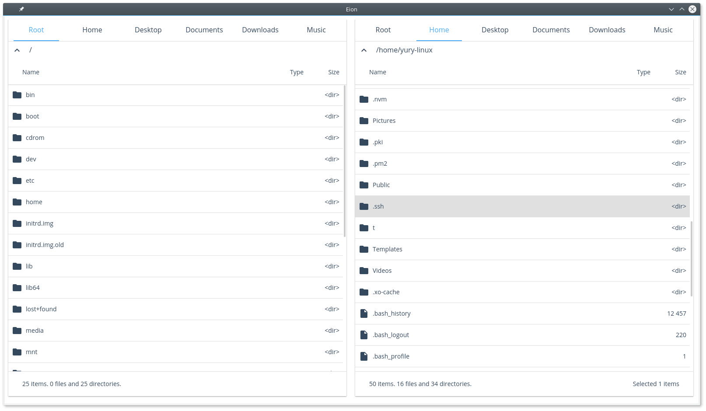

# Eion

Eion is a modern file manager built with web technologies.

Screenshot:

## Trying it out:

0. [Install `boot`](https://github.com/boot-clj/boot#install)
1. Clone the repo
2. run `boot watch dev-build`
3. run `electron target/`

## Project goals

### Project goals:
* run on Windows and Linux
* provide basic file and directory operations
  - Execute
  - Create
  - Copy
  - Move
  - Rename
  - Delete

### Project non-goals:
* compete with other File Managers
* provide a lot of customization points
* support plugins (at least not for 1.0)
* support cloud storage

## License

MIT © Yury Solovyov
